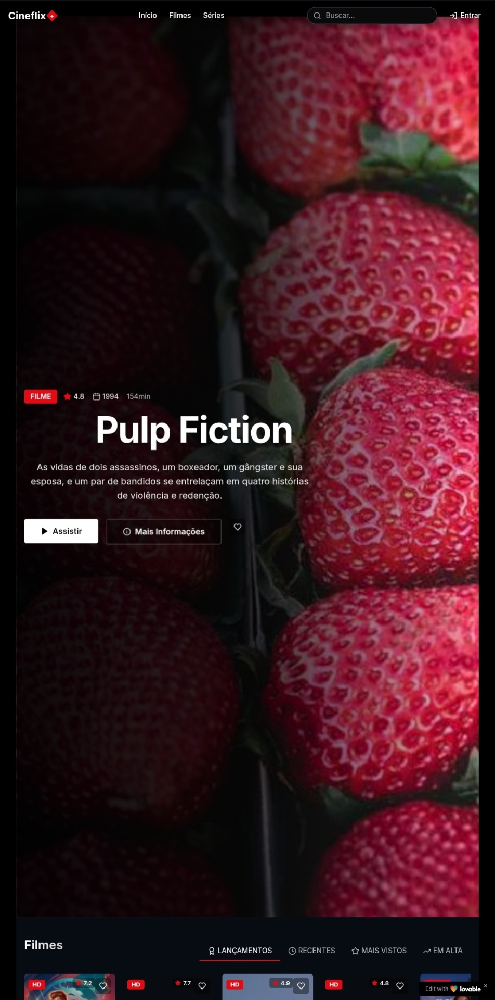

# <div align="center">🎬 Cineflix - Sua Plataforma de Streaming Personalizada 🍿</div>

<div align="center">
  
</div>

## 📋 Sobre o Projeto

Cineflix é uma plataforma de streaming completa que permite aos usuários assistir filmes e séries, interagir com conteúdo através de comentários, criar listas de favoritos, e muito mais! Com uma interface intuitiva inspirada nas melhores plataformas de streaming do mercado, o Cineflix oferece uma experiência rica e personalizada para os amantes de cinema e séries.

### ✨ Recursos Principais

- 🎥 **Catálogo de Filmes e Séries**: Acesso a uma vasta biblioteca de conteúdo organizado por categorias
- 📺 **Player de Vídeo Integrado**: Assista ao conteúdo diretamente na plataforma com player personalizado
- 👤 **Sistema de Autenticação**: Cadastro e login de usuários com Supabase Auth
- ❤️ **Lista de Favoritos**: Marque seus filmes e séries favoritos para assistir mais tarde
- 💬 **Sistema de Comentários**: Interaja com outros usuários através de comentários nos filmes e séries
- 🔔 **Notificações**: Receba atualizações sobre novos conteúdos e interações
- 🔍 **Busca Avançada**: Encontre facilmente o conteúdo que deseja assistir
- 📱 **Design Responsivo**: Experiência otimizada em dispositivos móveis e desktop
- 👑 **Painel de Administração**: Gerenciamento completo de usuários, filmes e séries
- 🌙 **Modo Escuro**: Interface adaptada para visualização noturna

## 🛠️ Tecnologias Utilizadas

O projeto é construído com um stack moderno de tecnologias front-end e back-end:

### Front-end
- ⚛️ **React 18**: Biblioteca JavaScript para construção de interfaces
- 🔄 **React Router**: Gerenciamento de rotas e navegação
- 📝 **TypeScript**: Tipagem estática para desenvolvimento mais seguro
- 🎨 **Tailwind CSS**: Framework CSS utilitário para estilização rápida
- 🧩 **Shadcn UI**: Componentes reutilizáveis e acessíveis
- 📊 **Recharts**: Biblioteca para criação de gráficos (painel admin)
- 🔍 **TanStack Query**: Gerenciamento de estado e cache para dados remotos
- 📦 **Vite**: Build tool rápida para desenvolvimento moderno

### Back-end
- 🔐 **Supabase**: Plataforma completa para back-end com:
  - 🗃️ **Banco de Dados PostgreSQL**: Armazenamento relacional
  - 🔒 **Autenticação e Autorização**: Sistema completo de login
  - 📂 **Storage**: Armazenamento de arquivos e mídia
  - 🔌 **Funções e APIs**: Funções serverless e endpoints RESTful

### Utilitários
- 🔔 **Sonner**: Sistema de notificações toast
- 📅 **date-fns**: Manipulação de datas
- 🎭 **Lucide React**: Biblioteca de ícones
- 📝 **React Hook Form** + **Zod**: Validação de formulários

## 🚀 Como Instalar e Executar

### Pré-requisitos
- Node.js (v16+)
- npm ou yarn
- Conta no Supabase (para o backend)

### Passos para Execução Local

1. **Clone o repositório**
```sh
git clone <URL_DO_REPOSITORIO>
cd cineflix
```

2. **Instale as dependências**
```sh
npm install
# ou
yarn install
```

3. **Configure o Supabase**
   - Crie uma conta no [Supabase](https://supabase.com)
   - Crie um novo projeto
   - Copie as credenciais de API (URL e anon key) para o arquivo .env

4. **Configure as variáveis de ambiente**
Crie um arquivo `.env.local` na raiz do projeto com o seguinte conteúdo:
```
VITE_SUPABASE_URL=sua_url_do_supabase
VITE_SUPABASE_ANON_KEY=sua_chave_anon_do_supabase
```

5. **Execute o projeto em modo de desenvolvimento**
```sh
npm run dev
# ou
yarn dev
```

6. Acesse `http://localhost:8080` no seu navegador

## 🗄️ Configuração Detalhada do Banco de Dados

O projeto utiliza o Supabase como backend, que por sua vez usa PostgreSQL. Vamos detalhar como configurar corretamente o banco de dados para que todas as funcionalidades funcionem adequadamente:

### 1. Criação do Projeto Supabase

1. Acesse [Supabase](https://supabase.com) e faça login ou crie uma conta
2. Crie um novo projeto e escolha uma região próxima aos seus usuários
3. Defina uma senha forte para o banco de dados PostgreSQL (guarde-a com segurança)
4. Aguarde a criação do projeto (pode levar alguns minutos)

### 2. Configuração da Autenticação

1. No dashboard do Supabase, vá para "Authentication" > "Providers"
2. Ative o método "Email" e configure as seguintes opções:
   - Ative "Enable Email Confirmations" para maior segurança
   - Configure o template de e-mail de confirmação
3. Se desejar, ative outros provedores como Google, GitHub, etc.

### 3. Criação das Tabelas

Copie e execute os seguintes scripts SQL no SQL Editor do Supabase:

#### `perfis` - Informações de perfil de usuário
```sql
CREATE TABLE perfis (
  id UUID REFERENCES auth.users NOT NULL PRIMARY KEY,
  nome TEXT,
  email TEXT NOT NULL,
  avatar_url TEXT,
  created_at TIMESTAMP WITH TIME ZONE DEFAULT NOW()
);

-- Trigger para criar automaticamente um perfil quando um usuário se registra
CREATE OR REPLACE FUNCTION public.handle_new_user()
RETURNS TRIGGER AS $$
BEGIN
  INSERT INTO public.perfis (id, email, nome)
  VALUES (new.id, new.email, new.raw_user_meta_data->>'nome');
  RETURN new;
END;
$$ LANGUAGE plpgsql SECURITY DEFINER;

CREATE TRIGGER on_auth_user_created
  AFTER INSERT ON auth.users
  FOR EACH ROW EXECUTE PROCEDURE public.handle_new_user();
```

#### `papeis_usuario` - Papéis de usuário (admin, etc)
```sql
CREATE TABLE papeis_usuario (
  id UUID DEFAULT uuid_generate_v4() PRIMARY KEY,
  user_id UUID REFERENCES perfis(id) ON DELETE CASCADE NOT NULL,
  papel TEXT NOT NULL,
  created_at TIMESTAMP WITH TIME ZONE DEFAULT NOW(),
  UNIQUE(user_id, papel)
);

-- Função para verificar se um usuário tem um determinado papel
CREATE OR REPLACE FUNCTION tem_papel(usuario_id UUID, tipo_papel_param TEXT)
RETURNS BOOLEAN
LANGUAGE plpgsql
SECURITY DEFINER
AS $$
BEGIN
  RETURN EXISTS (
    SELECT 1 FROM papeis_usuario
    WHERE user_id = usuario_id
    AND papel = tipo_papel_param
  );
END;
$$;

-- Criar o primeiro administrador (substitua pelo seu ID de usuário após registro)
-- INSERT INTO papeis_usuario (user_id, papel) VALUES ('SEU_ID_USUARIO', 'admin');
```

#### `filmes` - Catálogo de filmes
```sql
CREATE TABLE filmes (
  id UUID DEFAULT uuid_generate_v4() PRIMARY KEY,
  titulo TEXT NOT NULL,
  sinopse TEXT,
  ano INTEGER,
  duracao INTEGER,
  poster_url TEXT,
  backdrop_url TEXT,
  trailer_url TEXT,
  video_url TEXT,
  generos TEXT[],
  classificacao FLOAT,
  created_at TIMESTAMP WITH TIME ZONE DEFAULT NOW(),
  imdb_id TEXT,
  tmdb_id INTEGER
);
```

#### `series` - Catálogo de séries
```sql
CREATE TABLE series (
  id UUID DEFAULT uuid_generate_v4() PRIMARY KEY,
  titulo TEXT NOT NULL,
  sinopse TEXT,
  ano_inicio INTEGER,
  ano_fim INTEGER,
  poster_url TEXT,
  backdrop_url TEXT,
  trailer_url TEXT,
  generos TEXT[],
  classificacao FLOAT,
  created_at TIMESTAMP WITH TIME ZONE DEFAULT NOW(),
  imdb_id TEXT,
  tmdb_id INTEGER
);
```

#### `temporadas` - Temporadas das séries
```sql
CREATE TABLE temporadas (
  id UUID DEFAULT uuid_generate_v4() PRIMARY KEY,
  serie_id UUID REFERENCES series(id) ON DELETE CASCADE,
  numero INTEGER NOT NULL,
  titulo TEXT,
  sinopse TEXT,
  poster_url TEXT,
  ano INTEGER,
  created_at TIMESTAMP WITH TIME ZONE DEFAULT NOW()
);
```

#### `episodios` - Episódios das temporadas
```sql
CREATE TABLE episodios (
  id UUID DEFAULT uuid_generate_v4() PRIMARY KEY,
  temporada_id UUID REFERENCES temporadas(id) ON DELETE CASCADE,
  numero INTEGER NOT NULL,
  titulo TEXT NOT NULL,
  sinopse TEXT,
  duracao INTEGER,
  video_url TEXT,
  still_url TEXT,
  created_at TIMESTAMP WITH TIME ZONE DEFAULT NOW()
);
```

#### `favoritos` - Lista de favoritos dos usuários
```sql
CREATE TABLE favoritos (
  id UUID DEFAULT uuid_generate_v4() PRIMARY KEY,
  user_id UUID REFERENCES perfis(id) ON DELETE CASCADE,
  filme_id UUID REFERENCES filmes(id) ON DELETE CASCADE,
  serie_id UUID REFERENCES series(id) ON DELETE CASCADE,
  created_at TIMESTAMP WITH TIME ZONE DEFAULT NOW(),
  CHECK ((filme_id IS NULL AND serie_id IS NOT NULL) OR (filme_id IS NOT NULL AND serie_id IS NULL))
);
```

#### `comentarios` - Comentários em filmes e séries
```sql
CREATE TABLE comentarios (
  id UUID DEFAULT uuid_generate_v4() PRIMARY KEY,
  user_id UUID REFERENCES perfis(id) ON DELETE CASCADE NOT NULL,
  filme_id UUID REFERENCES filmes(id) ON DELETE CASCADE,
  serie_id UUID REFERENCES series(id) ON DELETE CASCADE,
  texto TEXT NOT NULL,
  created_at TIMESTAMP WITH TIME ZONE DEFAULT NOW(),
  CHECK ((filme_id IS NULL AND serie_id IS NOT NULL) OR (filme_id IS NOT NULL AND serie_id IS NULL))
);
```

#### `notificacoes` - Sistema de notificações
```sql
CREATE TABLE notificacoes (
  id UUID DEFAULT uuid_generate_v4() PRIMARY KEY,
  user_id UUID REFERENCES perfis(id) ON DELETE CASCADE NOT NULL,
  titulo TEXT NOT NULL,
  mensagem TEXT NOT NULL,
  lida BOOLEAN DEFAULT FALSE,
  created_at TIMESTAMP WITH TIME ZONE DEFAULT NOW()
);

-- Trigger para enviar notificação quando um comentário é feito em um conteúdo
CREATE OR REPLACE FUNCTION enviar_notificacao_comentario()
RETURNS TRIGGER AS $$
DECLARE
  titulo_conteudo TEXT;
  tipo_conteudo TEXT;
  usuario_nome TEXT;
BEGIN
  -- Obter nome do usuário que comentou
  SELECT nome INTO usuario_nome FROM perfis WHERE id = NEW.user_id;
  
  -- Determinar tipo e título do conteúdo
  IF NEW.filme_id IS NOT NULL THEN
    SELECT titulo INTO titulo_conteudo FROM filmes WHERE id = NEW.filme_id;
    tipo_conteudo := 'filme';
  ELSE
    SELECT titulo INTO titulo_conteudo FROM series WHERE id = NEW.serie_id;
    tipo_conteudo := 'série';
  END IF;
  
  -- Enviar notificação para cada administrador
  INSERT INTO notificacoes (user_id, titulo, mensagem)
  SELECT pu.user_id, 
         'Novo comentário', 
         COALESCE(usuario_nome, 'Um usuário') || ' comentou no ' || tipo_conteudo || ' ' || titulo_conteudo
  FROM papeis_usuario pu
  WHERE pu.papel = 'admin';
  
  RETURN NEW;
END;
$$ LANGUAGE plpgsql SECURITY DEFINER;

CREATE TRIGGER on_new_comment
  AFTER INSERT ON comentarios
  FOR EACH ROW EXECUTE PROCEDURE enviar_notificacao_comentario();
```

### 4. Configuração de Políticas de Segurança (RLS)

Para garantir a segurança dos dados, é necessário configurar as políticas RLS (Row Level Security):

```sql
-- Ativar RLS em todas as tabelas
ALTER TABLE perfis ENABLE ROW LEVEL SECURITY;
ALTER TABLE papeis_usuario ENABLE ROW LEVEL SECURITY;
ALTER TABLE filmes ENABLE ROW LEVEL SECURITY;
ALTER TABLE series ENABLE ROW LEVEL SECURITY;
ALTER TABLE temporadas ENABLE ROW LEVEL SECURITY;
ALTER TABLE episodios ENABLE ROW LEVEL SECURITY;
ALTER TABLE favoritos ENABLE ROW LEVEL SECURITY;
ALTER TABLE comentarios ENABLE ROW LEVEL SECURITY;
ALTER TABLE notificacoes ENABLE ROW LEVEL SECURITY;

-- Políticas para perfis
CREATE POLICY "Usuários podem ver todos os perfis"
  ON perfis FOR SELECT
  USING (true);

CREATE POLICY "Usuários podem editar apenas o próprio perfil"
  ON perfis FOR UPDATE
  USING (auth.uid() = id);

-- Políticas para papeis_usuario
CREATE POLICY "Apenas admins gerenciam papéis"
  ON papeis_usuario 
  USING (tem_papel(auth.uid(), 'admin'));

CREATE POLICY "Todos podem consultar papéis"
  ON papeis_usuario FOR SELECT
  USING (true);

-- Políticas para filmes
CREATE POLICY "Todos podem ver filmes"
  ON filmes FOR SELECT
  USING (true);

CREATE POLICY "Apenas admins podem gerenciar filmes"
  ON filmes
  USING (tem_papel(auth.uid(), 'admin'));

-- Políticas para séries
CREATE POLICY "Todos podem ver séries"
  ON series FOR SELECT
  USING (true);

CREATE POLICY "Apenas admins podem gerenciar séries"
  ON series
  USING (tem_papel(auth.uid(), 'admin'));

-- Políticas para temporadas
CREATE POLICY "Todos podem ver temporadas"
  ON temporadas FOR SELECT
  USING (true);

CREATE POLICY "Apenas admins podem gerenciar temporadas"
  ON temporadas
  USING (tem_papel(auth.uid(), 'admin'));

-- Políticas para episódios
CREATE POLICY "Todos podem ver episódios"
  ON episodios FOR SELECT
  USING (true);

CREATE POLICY "Apenas admins podem gerenciar episódios"
  ON episodios
  USING (tem_papel(auth.uid(), 'admin'));

-- Políticas para favoritos
CREATE POLICY "Usuários podem ver seus próprios favoritos"
  ON favoritos FOR SELECT
  USING (auth.uid() = user_id);

CREATE POLICY "Usuários podem gerenciar seus próprios favoritos"
  ON favoritos FOR INSERT
  WITH CHECK (auth.uid() = user_id);

CREATE POLICY "Usuários podem remover seus próprios favoritos"
  ON favoritos FOR DELETE
  USING (auth.uid() = user_id);

-- Políticas para comentários
CREATE POLICY "Todos podem ver comentários"
  ON comentarios FOR SELECT
  USING (true);

CREATE POLICY "Usuários autenticados podem criar comentários"
  ON comentarios FOR INSERT
  WITH CHECK (auth.uid() = user_id);

CREATE POLICY "Usuários podem editar seus próprios comentários"
  ON comentarios FOR UPDATE
  USING (auth.uid() = user_id);

CREATE POLICY "Usuários podem excluir seus próprios comentários"
  ON comentarios FOR DELETE
  USING (auth.uid() = user_id OR tem_papel(auth.uid(), 'admin'));

-- Políticas para notificações
CREATE POLICY "Usuários podem ver suas próprias notificações"
  ON notificacoes FOR SELECT
  USING (auth.uid() = user_id);

CREATE POLICY "Usuários podem marcar suas notificações como lidas"
  ON notificacoes FOR UPDATE
  USING (auth.uid() = user_id)
  WITH CHECK (auth.uid() = user_id AND NEW.lida <> OLD.lida);
```

### 5. Inserção de Dados Iniciais (Opcional)

Para testar a aplicação, você pode inserir alguns dados iniciais:

```sql
-- Inserir filmes de exemplo
INSERT INTO filmes (titulo, sinopse, ano, duracao, generos, classificacao, poster_url, backdrop_url, video_url)
VALUES 
('Interestelar', 'Em um futuro distópico onde a Terra está se tornando inabitável, um grupo de astronautas viaja através de um buraco de minhoca em busca de um novo lar para a humanidade.', 2014, 169, ARRAY['Ficção Científica', 'Aventura', 'Drama'], 8.6, 'https://image.tmdb.org/t/p/w500/nCbkOyOMTEwlEV0LtCOvCnwEONA.jpg', 'https://image.tmdb.org/t/p/original/tbhdm8UJAb4ViCTsulYFL3lxMCd.jpg', 'https://www.youtube.com/watch?v=i2uHZLNeXOU'),
('A Origem', 'Um ladrão que rouba segredos corporativos através do uso da tecnologia de compartilhamento de sonhos, recebe a tarefa inversa de plantar uma ideia na mente de um CEO.', 2010, 148, ARRAY['Ação', 'Ficção Científica', 'Aventura'], 8.4, 'https://image.tmdb.org/t/p/w500/oYuLEt3zVCKq57qu2F8dT7NIa6f.jpg', 'https://image.tmdb.org/t/p/original/s3TBrRGB1iav7gFOCNx3H31MoES.jpg', 'https://www.youtube.com/watch?v=YoHD9XEInc0');

-- Inserir séries de exemplo
INSERT INTO series (titulo, sinopse, ano_inicio, ano_fim, generos, classificacao, poster_url, backdrop_url)
VALUES 
('Breaking Bad', 'Um professor de química do ensino médio diagnosticado com câncer de pulmão inoperável se volta para a fabricação e venda de metanfetamina para garantir o futuro financeiro de sua família.', 2008, 2013, ARRAY['Drama', 'Crime', 'Suspense'], 9.5, 'https://image.tmdb.org/t/p/w500/ggFHVNu6YYI5L9pCfOacjizRGt.jpg', 'https://image.tmdb.org/t/p/original/tsRy63Mu5cu8etL1X7ZLyf7UP1M.jpg'),
('Stranger Things', 'Quando um garoto desaparece, a cidade toda participa nas buscas. Mas o que encontram são segredos, forças sobrenaturais e uma menina.', 2016, NULL, ARRAY['Drama', 'Fantasia', 'Mistério'], 8.7, 'https://image.tmdb.org/t/p/w500/49WJfeN0moxb9IPfGn8AIqMGskD.jpg', 'https://image.tmdb.org/t/p/original/56v2KjBlU4XaOv9rVYEQypROD7P.jpg');
```

### 6. Extensões Úteis

Adicione extensões úteis ao PostgreSQL:

```sql
-- Habilitar extensão para gerar UUIDs
CREATE EXTENSION IF NOT EXISTS "uuid-ossp";

-- Habilitar busca de texto completo
CREATE EXTENSION IF NOT EXISTS "pg_trgm";
CREATE EXTENSION IF NOT EXISTS "unaccent";

-- Criar índice para busca de texto em filmes
CREATE INDEX IF NOT EXISTS idx_filmes_titulo ON filmes USING GIN (to_tsvector('portuguese', titulo));
CREATE INDEX IF NOT EXISTS idx_filmes_sinopse ON filmes USING GIN (to_tsvector('portuguese', sinopse));

-- Criar índice para busca de texto em séries
CREATE INDEX IF NOT EXISTS idx_series_titulo ON series USING GIN (to_tsvector('portuguese', titulo));
CREATE INDEX IF NOT EXISTS idx_series_sinopse ON series USING GIN (to_tsvector('portuguese', sinopse));
```

### 7. Funções Auxiliares

```sql
-- Função para pesquisa de conteúdo
CREATE OR REPLACE FUNCTION search_content(search_term TEXT)
RETURNS TABLE (
  id UUID,
  titulo TEXT,
  tipo TEXT,
  ano INTEGER,
  poster_url TEXT,
  classificacao FLOAT
) LANGUAGE plpgsql AS $$
BEGIN
  RETURN QUERY
  SELECT f.id, f.titulo, 'filme' as tipo, f.ano, f.poster_url, f.classificacao
  FROM filmes f
  WHERE 
    to_tsvector('portuguese', f.titulo) @@ to_tsquery('portuguese', search_term) OR
    to_tsvector('portuguese', f.sinopse) @@ to_tsquery('portuguese', search_term) OR
    f.titulo ILIKE '%' || search_term || '%'
  UNION
  SELECT s.id, s.titulo, 'serie' as tipo, s.ano_inicio, s.poster_url, s.classificacao
  FROM series s
  WHERE 
    to_tsvector('portuguese', s.titulo) @@ to_tsquery('portuguese', search_term) OR
    to_tsvector('portuguese', s.sinopse) @@ to_tsquery('portuguese', search_term) OR
    s.titulo ILIKE '%' || search_term || '%'
  ORDER BY classificacao DESC
  LIMIT 20;
END; $$;
```

### 8. Recomendações de Segurança

1. **Autenticação**:
   - Defina uma política de senhas forte
   - Configure a expiração de tokens JWT adequada (recomendado: 24 horas)
   - Ative a autenticação de dois fatores (2FA) se necessário

2. **RLS Políticas**:
   - Sempre teste as políticas para garantir que funcionam como esperado
   - Adicione regras específicas para cada tipo de operação (SELECT, INSERT, UPDATE, DELETE)
   - Revise periodicamente as políticas para garantir segurança

3. **Backups**:
   - Configure backups automáticos diários
   - Teste a restauração de backups regularmente

## 🚀 Self-Hosting

### Opção 1: Deploy da aplicação via GitHub e Vercel

1. Crie um novo repositório no GitHub
2. Faça push do código para o repositório
3. Crie uma conta na [Vercel](https://vercel.com)
4. Conecte seu repositório GitHub à Vercel
5. Configure as variáveis de ambiente na Vercel:
   - `VITE_SUPABASE_URL`
   - `VITE_SUPABASE_ANON_KEY`
6. Deploy!

### Opção 2: Self-hosting com Docker

1. Crie um arquivo `Dockerfile` na raiz do projeto:
```dockerfile
FROM node:18-alpine as build

WORKDIR /app
COPY package*.json ./
RUN npm install
COPY . .
RUN npm run build

FROM nginx:alpine
COPY --from=build /app/dist /usr/share/nginx/html
COPY nginx.conf /etc/nginx/conf.d/default.conf

EXPOSE 80
CMD ["nginx", "-g", "daemon off;"]
```

2. Crie um arquivo `nginx.conf`:
```
server {
    listen 80;
    root /usr/share/nginx/html;
    index index.html;

    location / {
        try_files $uri $uri/ /index.html;
    }
}
```

3. Construa e execute o contêiner Docker:
```sh
docker build -t cineflix .
docker run -p 8080:80 cineflix
```

### Opção 3: VPS Bare Metal

Para hospedar em um servidor VPS:

1. Configure um servidor Ubuntu/Debian:
```sh
sudo apt update && sudo apt upgrade -y
sudo apt install -y nginx certbot python3-certbot-nginx nodejs npm
```

2. Clone o repositório:
```sh
git clone <URL_DO_REPOSITORIO> /var/www/cineflix
cd /var/www/cineflix
```

3. Instale dependências e construa o projeto:
```sh
npm install
npm run build
```

4. Configure o Nginx:
```sh
sudo nano /etc/nginx/sites-available/cineflix
```

Adicione:
```
server {
    listen 80;
    server_name seu-dominio.com;
    root /var/www/cineflix/dist;
    index index.html;

    location / {
        try_files $uri $uri/ /index.html;
    }
}
```

5. Ative o site e configure HTTPS:
```sh
sudo ln -s /etc/nginx/sites-available/cineflix /etc/nginx/sites-enabled/
sudo certbot --nginx -d seu-dominio.com
sudo systemctl restart nginx
```

## 📝 Licença

Este projeto está licenciado sob a licença MIT.

## 🙏 Agradecimentos

- **Scrowzer** - Desenvolvimento Frontend
- **JrMaFia** - Desenvolvimento Backend e integrações
- [Supabase](https://supabase.com) - Backend como serviço
- [Shadcn UI](https://ui.shadcn.com/) - Componentes React
- Todos os desenvolvedores de bibliotecas open source utilizadas neste projeto

---

<div align="center">
  <p>Desenvolvido com ❤️ por Scrowzer & JrMaFia</p>
</div>
